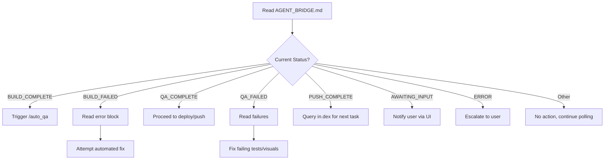

# Poll Agent Bridge (Platinum Level)

**Autonomous monitoring protocol for cross-agent coordination via AGENT_BRIDGE.md.**

---

## 1. Overview

The Poll skill monitors `AGENT_BRIDGE.md` for status changes and triggers appropriate workflows. It enables asynchronous coordination between agents (wii, in.dex, Antigravity, OpenClaw).

---

## 2. AGENT_BRIDGE.md Location

```
/Volumes/X SSD 2025/Users/narrowchannel/Desktop/indiiOS-Alpha-Electron/AGENT_BRIDGE.md
```

---

## 3. Status Definitions

| Status | Meaning | Action |
|--------|---------|--------|
| `BUILD_PENDING` | Build in progress | Wait, no action |
| `BUILD_COMPLETE` | Build succeeded | Trigger QA workflow |
| `BUILD_FAILED` | Build failed | Read error, attempt fix |
| `QA_IN_PROGRESS` | QA running | Wait, no action |
| `QA_COMPLETE` | QA passed | Ready for deploy/push |
| `QA_FAILED` | QA failed | Read failures, fix issues |
| `PUSH_PENDING` | Git push in progress | Wait, no action |
| `PUSH_COMPLETE` | Git push succeeded | Query in.dex for next steps |
| `AWAITING_INPUT` | Blocked on user | Notify user, wait |
| `ERROR` | Critical failure | Escalate immediately |

---

## 4. Polling Logic

### 4.1 Status Check Flow



### 4.2 Polling Implementation

```typescript
async function pollAgentBridge(): Promise<void> {
  const bridgeContent = await readFile('AGENT_BRIDGE.md');
  const status = parseStatus(bridgeContent);
  
  switch (status.current) {
    case 'BUILD_COMPLETE':
      await triggerWorkflow('/auto_qa');
      break;
      
    case 'BUILD_FAILED':
      const errorBlock = extractErrorBlock(bridgeContent);
      await attemptAutoFix(errorBlock);
      break;
      
    case 'QA_FAILED':
      const failures = extractFailures(bridgeContent);
      await fixQAFailures(failures);
      break;
      
    case 'PUSH_COMPLETE':
      await queryIndexForNextTask();
      break;
      
    default:
      // No action, wait for next poll
      break;
  }
}
```

---

## 5. AGENT_BRIDGE.md Format

```markdown
# Agent Bridge Status

## Current Status
`BUILD_COMPLETE`

## Last Updated
2026-02-06T14:30:00Z

## Active Agent
Antigravity

## Context
Build succeeded. TypeScript compilation passed. Ready for QA.

## Error Block
<!-- Populated only on BUILD_FAILED or ERROR -->
```

error message here

```

## QA Results
<!-- Populated after QA workflow -->
- [ ] Visual regression passed
- [ ] E2E tests passed
- [ ] Accessibility audit passed

## Next Steps
1. Run /auto_qa workflow
2. Upon success, push to remote

## Communication
Questions → OpenClaw interface
POL requests → in.dex agent
```

---

## 6. Integration with /auto_qa

When `BUILD_COMPLETE` is detected:

```
1. Update bridge: QA_IN_PROGRESS
2. Run browser-based visual tests
3. Run E2E test suite
4. Capture screenshots for regression
5. On success: Update bridge to QA_COMPLETE
6. On failure: Update bridge to QA_FAILED with details
```

---

## 7. Auto-Fix Capabilities

### 7.1 Build Failures (AUTO-FIXABLE)

| Error Type | Auto-Fix Action |
|------------|-----------------|
| TypeScript type error | Analyze, apply fix, rebuild |
| Missing import | Add import statement |
| Unused variable | Remove or mark as used |
| Lint failure | Run `npm run lint:fix` |

### 7.2 Build Failures (ESCALATE)

| Error Type | Escalation Action |
|------------|-------------------|
| Runtime crash | Add to error ledger, notify user |
| Dependency conflict | Notify user for resolution |
| Environment issue | Document, notify user |
| Complex type error | Add context, ask for guidance |

---

## 8. Cross-Agent Protocol

### 8.1 Handoff to in.dex

When bridge shows `PUSH_COMPLETE`:

```javascript
// Query in.dex for next task
await queryAgent('in.dex', {
  type: 'POL_REQUEST',  // Point of Leverage request
  context: {
    lastAction: 'PUSH_COMPLETE',
    repository: 'indiiOS-Alpha-Electron',
    branch: await getCurrentBranch(),
    commitHash: await getLastCommitHash()
  }
});
```

### 8.2 Communication via OpenClaw

For questions or when stuck:

```javascript
// Route question to OpenClaw
await sendToOpenClaw({
  type: 'QUESTION',
  message: 'Need clarification on XYZ',
  context: getBridgeContext()
});
```

---

## 9. Status Update Protocol

When updating the bridge:

```javascript
async function updateBridgeStatus(
  newStatus: BridgeStatus,
  context?: string,
  errorBlock?: string
): Promise<void> {
  const timestamp = new Date().toISOString();
  
  const update = `
## Current Status
\`${newStatus}\`

## Last Updated
${timestamp}

## Active Agent
Antigravity

## Context
${context || 'Status updated automatically.'}

${errorBlock ? `## Error Block\n\`\`\`\n${errorBlock}\n\`\`\`` : ''}
`;
  
  await updateFile('AGENT_BRIDGE.md', update);
}
```

---

## 10. Monitoring Best Practices

1. **Poll Frequency**: Every 30 seconds during active work, every 5 minutes when idle
2. **Timeout Handling**: If status unchanged for 10 minutes, check if stuck
3. **Error Accumulation**: Track consecutive errors, escalate after 3
4. **Idempotency**: Ensure workflows can be safely re-triggered
5. **Logging**: Log all status transitions for debugging

---

## 11. Example Workflow Trigger

```javascript
// When triggered by BUILD_COMPLETE
async function handleBuildComplete(): Promise<void> {
  // 1. Update status to QA_IN_PROGRESS
  await updateBridgeStatus('QA_IN_PROGRESS', 'Starting automated QA workflow');
  
  // 2. Execute QA workflow
  try {
    const qaResult = await executeWorkflow('/auto_qa');
    
    if (qaResult.success) {
      await updateBridgeStatus('QA_COMPLETE', 'All QA checks passed');
    } else {
      await updateBridgeStatus('QA_FAILED', 'QA checks failed', qaResult.errors.join('\n'));
    }
  } catch (error) {
    await updateBridgeStatus('ERROR', 'QA workflow crashed', error.message);
  }
}
```
