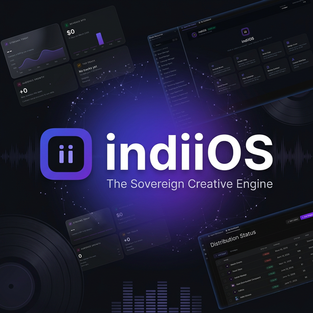

<div align="center">
  
</div>

# indiiOS: The Sovereign Creative Engine

**The First AI-Native Operating System for Independent Artists & Producers.**

indiiOS is not just a platform; it is a **Digital Handshake**. It is a multi-tenant, sovereign creative workspace designed to empower independent music producers, visual artists, and labels. By unifying AI-powered asset generation, automated distribution, and intelligent business operations, indiiOS enables creators to own their infrastructure, their data, and their future.

[](https://github.com/the-walking-agency-det/indiiOS-Alpha-Electron)
[](https://indiios-studio.web.app)
[](https://react.dev)
[](https://www.typescriptlang.org)
[](https://www.electronjs.org)
[](https://ai.google.dev)
[](https://nodejs.org)

---

## 💠 The Vision

indiiOS solves the "fragmentation trap" where artists lose 40% of their creative time managing 20+ different tools — and 20–30% of their revenue to aggregators who change their TOS whenever they feel like it. It provides a unified **Neural Cortex** that understands your brand, your sound, and your business goals across every module.

**indiiOS is the distributor.** We hold a registered DDEX Party ID and deliver directly to DSPs. The aggregator middleman layer doesn't exist here. Your masters stay yours, your royalties stay yours, and your data stays yours.

---

## 🏗️ 3-Layer Architecture

To ensure 99.9% reliability in probabilistic AI workflows, indiiOS operates on a rigorous 3-layer system:

```
┌──────────────────────────────────────────────────────────────┐
│  Layer 1: DIRECTIVE (Managerial)                             │
│  Natural language SOPs that define goals and safety bounds   │
│  → directives/                                               │
├──────────────────────────────────────────────────────────────┤
│  Layer 2: ORCHESTRATION (Intelligence)                       │
│  Hub-and-spoke agent system — reasons, routes, manages       │
│  → agents/ + src/services/agent/                             │
├──────────────────────────────────────────────────────────────┤
│  Layer 3: EXECUTION (Deterministic)                          │
│  Hard-coded scripts for API calls, file ops, DDEX gen        │
│  → execution/ + python/tools/                                │
└──────────────────────────────────────────────────────────────┘
```

**The Multiplier Effect:** By pushing complexity into deterministic execution layers, we avoid the "compound error" trap (where 90% accuracy over 5 biological steps leads to 59% overall success). Determinism at the base allows for reliability at the peak.

---

## 🤖 indii: The Hub-and-Spoke Agent System

The core of indiiOS is **indii**, an intelligent orchestration hub with **17 specialist agents**.

```
              ┌─────────────────────┐
              │   Agent Zero (Hub)  │
              │   Orchestrator      │
              └──────────┬──────────┘
                         │
    ┌────────────────────┼────────────────────┐
    │        │        │        │        │      │
 Creative  Brand   Music   Legal   Finance  Video
 Director  Agent   Agent   Agent   Agent   Agent
    │
  ┌─┴──────────────────────────────────────────┐
  Marketing  Social  Publishing  Licensing     │
  Agent      Agent   Agent       Agent         │
  │                                             │
  Publicist  Road    Generalist  Executor       │
  Agent      Agent   Agent       Agent         │
  └────────────────────────────────────────────┘
```

| Agent | Domain | Capabilities |
|-------|--------|-------------|
| **Agent Zero** | Hub Orchestrator | Session context, task routing, multi-agent coordination |
| **Creative Director** | Visual Identity | Brand-consistent AI image/video generation, style enforcement |
| **Music Agent** | Audio Intelligence | BPM, key, timbre analysis via `Essentia.js`, mastering QA |
| **Legal Agent** | Rights & Contracts | Real-time contract review, rights management, IP protection |
| **Finance Agent** | Revenue | Waterfall payout calculations, royalty tracking, tax reporting |
| **Marketing Agent** | Growth | Campaign execution, AI copywriting, audience targeting |
| **Video Agent** | Video Production | Veo 3.1 synthesis, shot sequencing, Director's Cut QA |
| **Brand Agent** | Brand Identity | Brand kit management, style guide enforcement |
| **Social Agent** | Social Media | Cross-platform posting, analytics, engagement optimization |
| **Publishing Agent** | Music Publishing | Song registration, rights administration |
| **Licensing Agent** | Sync & Licensing | Licensing deal management, sync opportunity matching |
| **Publicist Agent** | PR & Media | Press release generation, media outreach |
| **Road Agent** | Touring | Route planning, venue discovery, logistics |
| **Generalist Agent** | General Tasks | Flexible agent for uncategorized tasks |
| **Executor Agent** | Task Execution | High-reliability script execution and validation |

---

## 🧠 Always-On Memory Agent

Adapted from Google's [Always-On Memory Agent](https://github.com/GoogleCloudPlatform/generative-ai/tree/main/gemini/agents/always-on-memory-agent) reference architecture, rebuilt as a native TypeScript service with significant enhancements.

The Memory Agent is a **persistent, evolving memory system** that runs in the background — continuously ingesting, consolidating, and connecting information. Think of it as the platform's hippocampus: it processes raw experiences during idle time and surfaces cross-cutting insights on demand.

### How It Works

```
User Input / Files / Sessions
        │
        ▼
┌─────────────────────┐
│  Ingestion Pipeline  │  ← Entity extraction, topic assignment, importance scoring
│  (Gemini Flash)      │  ← Multimodal: text, images, audio, video, PDFs
└────────┬────────────┘
         │
         ▼
┌─────────────────────┐
│  Tiered Memory Store │  ← working → shortTerm → longTerm → archived
│  (Firestore)         │  ← Importance decay + reinforcement on access
└────────┬────────────┘
         │
    ┌────┴────┐
    ▼         ▼
┌────────┐ ┌──────────────┐
│ Query  │ │ Consolidation │  ← Timer-based background loop (every 30min)
│ Agent  │ │ Agent         │  ← Cross-cutting insight generation
│(Pro)   │ │(Flash)        │  ← Connection discovery between memories
└────────┘ └──────────────┘
```

### Key Features

| Feature | Description |
|---------|-------------|
| **4-Tier Memory** | Memories move through `working → shortTerm → longTerm → archived` based on age, access frequency, and importance |
| **Importance Decay** | Memories lose importance over time unless accessed (reinforcement learning) |
| **Entity Graph** | Extracted entities (people, companies, products) are linked across memories |
| **Multimodal Ingestion** | Supports 27 file types: text, images, audio, video, and PDFs |
| **Cross-Cutting Insights** | Background consolidation discovers patterns and generates insights with confidence scores |
| **Semantic Search** | Multi-signal ranking: semantic similarity + importance + recency + tier bonus |
| **Electron Inbox** | File watcher via IPC polls `~/indiiOS/memory-inbox/` for new files (desktop only) |
| **Dashboard UI** | Premium React dashboard with memory timeline, insight cards, and query interface |

### Usage

```typescript
import { alwaysOnMemoryEngine } from '@/services/agent/AlwaysOnMemoryEngine';

// Start the engine (called automatically on auth)
engine.start('user-123');

// Ingest text
await engine.ingestText('user-123', 'User prefers dark blue album art with minimal typography');

// Ingest a file (Electron desktop)
await engine.ingestFile('user-123', fileBytes, 'image/png', 'album-ref.png');

// Query with citations
const answer = await engine.queryMemory('user-123', 'What visual style does the user prefer?');

// Manual consolidation
await engine.runConsolidation('user-123');
```

---

## ⏱️ Timeline Orchestrator (Autonomous Campaign Engine)

The **Timeline Orchestrator** is indiiOS's progressive campaign automation system. It enables multi-month, fully autonomous marketing campaigns that escalate in intensity over time — from teaser posts in week 1 to daily multi-platform saturation by release day — all without manual intervention.

### How It Works

```
┌──────────────────────────────────────────────────────────────┐
│  Cloud Scheduler (every 15 min)                              │
│  → pollTimelineMilestones (Cloud Function)                   │
│    → Dispatches timeline/milestone.due events to Inngest     │
│      → executeMilestoneFn calls Gemini server-side           │
│        → Result stored in Firestore + audit log              │
│                                                              │
│  Zero human in the loop. Campaigns run at 3am unattended.    │
└──────────────────────────────────────────────────────────────┘
```

### Key Features

| Feature | Description |
|---------|-------------|
| **Progressive Intensity** | Campaigns start with low-frequency "seed" posts and auto-escalate through phases to high-frequency saturation toward the climax |
| **4 Pre-Built Templates** | Single Release (8 weeks), Album Rollout (16 weeks), Merch Drop (4 weeks), Tour Promotion (12 weeks) |
| **Agent-Agnostic** | Works with any specialist agent — marketing, social, brand, publicist, distribution, video, etc. |
| **Smart Asset Strategy** | Each milestone can `create_new` assets via AI, `use_existing` pre-made assets, or `auto` mode (agent decides) |
| **Lifecycle Management** | Draft → Active → Paused → Resumed → Completed / Cancelled — full control |
| **Adaptive Cadence** | Adjust posting frequency per-phase in real-time without rebuilding the timeline |
| **Inngest Durability** | Built-in retries (2x), concurrency limits (5), step-based execution for crash recovery |
| **Audit Trail** | Every autonomous execution is logged to `timelineExecutionLogs` for transparency |

### 9 Agent Tools

Any agent can orchestrate timelines using these registered tools:

| Tool | Purpose |
|------|---------|
| `create_timeline` | Create from template or custom brief |
| `activate_timeline` | Start autonomous execution |
| `pause_timeline` / `resume_timeline` | Lifecycle control |
| `advance_phase` | Skip to next intensity phase |
| `adjust_cadence` | Change posting frequency |
| `get_timeline_status` | Progress metrics |
| `list_timelines` | All user timelines |
| `list_timeline_templates` | Available templates |

### Usage

```typescript
import { timelineOrchestrator } from '@/services/timeline/TimelineOrchestratorService';

// Create a progressive campaign from a template
const timeline = await timelineOrchestrator.createTimeline('user-123', {
  title: 'Spring Album Rollout',
  domain: 'marketing',
  templateId: 'album_rollout_16w',
  startDate: '2026-04-01',
  goal: 'Build anticipation and drive 100k first-week streams',
  assetStrategy: 'create_new',
});

// Activate it — from here, Cloud Scheduler + Inngest handle everything
await timelineOrchestrator.activateTimeline('user-123', timeline.id);
```

### Architecture

```
src/services/timeline/
├── TimelineOrchestratorService.ts    # Core engine (creation, lifecycle, progress)
├── TimelinePhaseTemplates.ts         # 4 pre-built campaign templates
├── TimelineTypes.ts                  # Type definitions
└── TimelineOrchestratorService.test.ts  # 25 unit tests

src/services/agent/tools/
└── TimelineTools.ts                  # 9 agent tools (registered in TOOL_REGISTRY)

functions/src/timeline/
├── pollTimelineMilestones.ts         # Cloud Scheduler: finds due milestones
└── milestone_execution.ts            # Inngest: Gemini server-side execution
```

---

## 📦 Core Modules (36)

indiiOS ships with 36 lazy-loaded modules organized across four domains:

### 🎨 Creative Studios

| Module | Route | Description |
|--------|-------|-------------|
| **Creative Director** | `/creative` | Infinite Fabric.js canvas for AI image generation (Gemini 3 Pro Image), product visualization, and asset editing |
| **Video Producer** | `/video` | Production-grade pipeline for **Veo 3.1** video synthesis with Director's Cut QA step |
| **Workflow Lab** | `/workflow` | Node-based automation editor (React Flow) to chain complex AI tasks into repeatable creative recipes |
| **Design Studio** | `/design` | Brand-first design system for consistent visual identity |
| **Capture** | `/capture` | Quick-capture tool for ideas, references, and inspiration |

### 📈 Business Operations

| Module | Route | Description |
|--------|-------|-------------|
| **Distribution** | `/distribution` | Direct DDEX delivery to DSPs (Merlin, Apple, Spotify, Amazon, Tidal) — no aggregator middlemen |
| **Release Manager** | `/release` | End-to-end release lifecycle: metadata, artwork, scheduling, delivery, and QC |
| **Finance** | `/finance` | Streaming revenue tracking, waterfall royalty splits, and automated payout calculations |
| **Royalty** | `/royalty` | Detailed royalty statement parsing, reconciliation, and split management |
| **Legal** | `/legal` | AI-powered contract review, rights management, IP protection, and legal compliance |
| **Licensing** | `/licensing` | Sync licensing deal management and opportunity matching |
| **Publishing** | `/publishing` | Music publishing dashboard — song registration and rights administration |
| **Commerce** | `/commerce` | E-commerce integration for direct-to-fan sales |
| **Merchandise** | `/merch` | Merchandise and print-on-demand (POD) integration |

### 📣 Marketing & Growth

| Module | Route | Description |
|--------|-------|-------------|
| **Marketing** | `/marketing` | Campaign execution, AI copywriting, and brand asset management |
| **Brand Manager** | `/brand` | Brand kit management — logos, colors, fonts, voice guidelines |
| **Campaign Manager** | `/campaign` | Multi-channel campaign planning and execution |
| **Social** | `/social` | Cross-platform social media management and scheduling |
| **Publicist** | `/publicist` | Press release generation, media outreach, and PR management |
| **Showroom** | `/showroom` | Public-facing portfolio for showcasing releases and brand |

### 🛠️ Intelligence & Tools

| Module | Route | Description |
|--------|-------|-------------|
| **Agent Tools** | `/agent` | Hub for Agent Zero interactions and specialist agent routing |
| **Memory Agent** | `/memory` | Always-On Memory dashboard — memory timeline, insights, and query interface |
| **Knowledge Base** | `/knowledge` | Searchable knowledge repository for artists and labels |
| **Audio Analyzer** | `/audio-analyzer` | Deep audio analysis — BPM, key detection, timbre analysis via Essentia.js |
| **Road Manager** | `/road` | Tour logistics, fuel calculations, venue discovery, and route planning |
| **Files** | `/files` | Integrated file manager for project assets |
| **Marketplace** | `/marketplace` | Marketplace for beats, samples, presets, and services |
| **Web3** | `/web3` | Blockchain integration for NFTs and decentralized rights |
| **Analytics** | `/analytics` | Cross-platform streaming and revenue analytics |
| **Dashboard** | `/dashboard` | Central command — KPIs, recent activity, and quick actions |
| **Investor** | `/investor` | Investor-facing data room and pitch materials |
| **Observability** | `/observability` | System health monitoring and AI agent performance tracking |
| **History** | `/history` | Full activity log and audit trail |
| **Settings** | `/settings` | User preferences, organization management, and integrations |
| **Onboarding** | `/onboarding` | AI-driven onboarding flow with brand kit setup |
| **Debug** | `/debug` | Developer tools and system diagnostics |

---

## 🔐 Security & Compliance

### Privacy & Legal

- **GDPR Compliant** — Right to erasure, data portability, and explicit consent management
- **CCPA/CPRA Compliant** — "Do Not Sell My Personal Information" toggle with opt-out tracking
- **COPPA Aware** — Age verification gate during onboarding
- **Cookie Consent** — Granular consent banner with essential/analytics/marketing categories
- **Legal Pages** — Auto-generated Privacy Policy, Terms of Service, and Cookie Policy

### Security Hardening

- **HSTS Headers** — Strict Transport Security enforced via Firebase hosting
- **Sentry Integration** — Real-time error monitoring with PII scrubbing
- **Secret Scanning** — Automated gitleaks checks in CI/CD pipeline
- **App Check** — Firebase App Check for API abuse prevention
- **Context Isolation** — Electron runs with hardened sandbox and context isolation enabled
- **R2A2 Scanning** — Reflective Risk-Awareness scanning for prompt injection attacks

### API Credentials Policy

Firebase API keys are **identifiers, not secrets** — security is enforced via Firestore/Storage Security Rules. True secrets (Stripe keys, service accounts) are managed exclusively through environment variables and never committed to source control. See [`docs/API_CREDENTIALS_POLICY.md`](docs/API_CREDENTIALS_POLICY.md) for the full policy.

---

## 🚀 Tech Stack

### Frontend & Desktop

| Category | Technology | Notes |
|----------|-----------|-------|
| UI Framework | React 18 | Lazy-loaded modules via `React.lazy()` |
| Build | Vite 6.4 | Port 4242 for dev, terser minification in prod |
| Styling | TailwindCSS 4.1 | CSS-first config with `tailwind-merge` + `clsx` |
| State | Zustand 5.0 | Slice-based store pattern with persistence |
| Animation | Framer Motion 12.x | Micro-animations and page transitions |
| Canvas | Fabric.js 6.9 | Infinite canvas image editing |
| Graph Editor | React Flow 11.11 | Node-based workflow automation |
| Audio | Wavesurfer.js 7.11 + Essentia.js | Analysis and visualization |
| Video | Remotion 4.0 | Programmatic video rendering |
| 3D | Three.js 0.182 | `@react-three/fiber` integration |
| Charts | Recharts 3.6 | Data visualization |
| Router | React Router 7.11 | URL-synced navigation |
| UI Kit | Radix UI + Lucide Icons | Accessible primitives |
| Desktop | Electron 33 | Hardened sandbox, context isolation |

### Backend & AI

| Category | Technology | Notes |
|----------|-----------|-------|
| Cloud Functions | Firebase Functions 7.0 (Gen 2) | Node.js 22 runtime |
| AI SDK | `@google/genai` 1.30 + Genkit 1.26 | Unified Google Gen AI SDK |
| AI Models | Gemini 3 Pro / Flash / Image | See [Model Policy](MODEL_POLICY.md) |
| Video AI | Veo 3.1 | `veo-3.1-generate-preview` |
| TTS | Gemini 2.5 Pro TTS | `gemini-2.5-pro-tts` |
| Embeddings | `text-embedding-004` | Vector similarity search |
| Jobs | Inngest 3.46 | Reliable background task orchestration |
| Payments | Stripe 20.1 | Subscription billing and payouts |
| Database | Firestore | Real-time sync with security rules |
| Storage | Firebase Storage | Media assets with security rules |
| Analytics | BigQuery | Revenue analytics pipeline |
| Distribution | DDEX ERN 4.3 | Direct DSP delivery via SFTP |

### AI Model Policy

All AI interactions follow a strict model policy. Manual model string hardcoding is forbidden — always use `AI_MODELS` from `@/core/config/ai-models`.

| Task | Model | Thinking Level |
|------|-------|---------------|
| Complex Reasoning | `gemini-3-pro-preview` | HIGH |
| Fast Routing | `gemini-3-flash-preview` | MEDIUM |
| Image Generation | `gemini-3-pro-image-preview` | — |
| Video Generation | `veo-3.1-generate-preview` | — |
| Text-to-Speech | `gemini-2.5-pro-tts` | — |

> **Banned Models:** `gemini-1.5-*`, `gemini-2.0-*`, `gemini-pro`, `gemini-pro-vision` — runtime validation enforces this.

---

## 🛠️ Getting Started

### Prerequisites

- **Node.js:** >= 22.0.0
- **Firebase CLI:** `npm install -g firebase-tools`
- **Docker:** (Optional) Required for Agent Zero Sidecar execution

### Installation

```bash
git clone https://github.com/the-walking-agency-det/indiiOS-Alpha-Electron.git
cd indiiOS-Alpha-Electron
npm install
```

### Environment Setup

Copy `.env.example` to `.env` and provide your API keys:

```bash
cp .env.example .env
```

**Required:**

| Variable | Purpose |
|----------|---------|
| `VITE_API_KEY` | Gemini / Google AI key |
| `VITE_FIREBASE_API_KEY` | Firebase project identifier |
| `VITE_FIREBASE_PROJECT_ID` | Firebase project ID |
| `VITE_FIREBASE_AUTH_DOMAIN` | Firebase auth domain |
| `VITE_FIREBASE_STORAGE_BUCKET` | Storage bucket |

**Optional:**

| Variable | Purpose |
|----------|---------|
| `VITE_VERTEX_PROJECT_ID` | Vertex AI project |
| `VITE_VERTEX_LOCATION` | Vertex AI region |
| `VITE_GOOGLE_MAPS_API_KEY` | Google Maps |
| `VITE_SKIP_ONBOARDING` | Skip onboarding in dev |
| `VITE_FIREBASE_APP_CHECK_KEY` | App Check (required in prod) |

### Development

```bash
# Start Vite Studio (Port 4242)
npm run dev

# Start Electron App (Requires Vite running)
npm run desktop:dev
```

### Building

```bash
npm run build              # Typecheck + lint + Vite production build
npm run build:studio       # Vite build only (no lint/typecheck)
npm run build:landing      # Build landing page
npm run build:desktop:mac  # macOS (DMG/ZIP)
npm run build:desktop:win  # Windows (NSIS)
npm run build:desktop:linux # Linux (AppImage)
```

---

## 🧪 Testing & Quality

indiiOS maintains a **"Zero-Regression"** policy with multi-layer testing:

```bash
npm test                   # Vitest in watch mode
npm test -- --run          # Vitest once (CI mode)
npm run test:e2e           # Playwright E2E (60+ specs)
npm run lint               # ESLint check
npm run typecheck          # TypeScript type checking
```

| Layer | Tool | Coverage |
|-------|------|----------|
| **Unit** | Vitest (jsdom) | Service logic, store slices, utilities |
| **E2E** | Playwright | 60+ critical path specs (agent flows, creative persistence, mobile responsiveness) |
| **Accessibility** | axe-core 4.11 | WCAG 2.1 AA compliance |
| **Security** | gitleaks | Automated secret scanning in CI |
| **AI Agent** | Custom stress tests | "The Gauntlet" protocol for agent reliability |

### The Two-Strike Pivot Rule

If a fix fails verification **twice**:

1. **STOP** the current approach
2. **Re-diagnose** with extensive logging
3. **Propose** a fundamentally different solution
4. **Never** pivot to the "easy way out"

---

## 🚢 Deployment

### CI/CD Pipeline (GitHub Actions)

```
Push to main → Lint → Unit Tests → E2E Tests → Build Landing → Build Studio → Deploy to Firebase
```

| Target | Platform | Hosting |
|--------|----------|---------|
| Studio App | Web (SPA) | Firebase Hosting → `dist/` |
| Landing Page | Web | Firebase Hosting → `landing-page/dist/` |
| Desktop (macOS) | Electron | DMG/ZIP distribution |
| Desktop (Windows) | Electron | NSIS installer |
| Desktop (Linux) | Electron | AppImage |
| Cloud Functions | Firebase Functions | GCP Cloud Run (Gen 2) |

---

## 📂 Project Structure

```
indiiOS-Alpha-Electron/
├── src/                    # React application source
│   ├── core/               # App infrastructure (store, contexts, themes)
│   ├── modules/            # 36 lazy-loaded feature modules
│   ├── services/           # 40+ business logic services
│   ├── components/         # Shared UI components (Radix-based)
│   ├── hooks/              # Custom React hooks
│   ├── lib/                # Utility libraries
│   ├── types/              # TypeScript type definitions
│   └── config/             # App configuration
├── agents/                 # 17 AI agent definitions (hub-and-spoke)
├── execution/              # Deterministic scripts (Layer 3)
├── directives/             # AI agent SOPs (Layer 1)
├── python/                 # Python tools and API handlers
├── functions/              # Firebase Cloud Functions (Gen 2)
├── electron/               # Electron desktop wrapper
├── e2e/                    # Playwright E2E tests (60+ specs)
├── landing-page/           # Marketing site (React + Vite)
├── docs/                   # Documentation
└── scripts/                # Build and utility scripts
```

---

## 📜 Documentation

For deep-dives into specific subsystems:

| Document | Description |
|----------|-------------|
| [Architecture Standard](directives/architecture_standard.md) | 3-layer architecture guidelines |
| [Agent Stability Protocol](directives/agent_stability.md) | Agent reliability standards |
| [DDEX Implementation Plan](docs/DDEX_IMPLEMENTATION_PLAN.md) | Distribution engine specification |
| [Model Usage Policy](MODEL_POLICY.md) | AI model selection and enforcement |
| [API Credentials Policy](docs/API_CREDENTIALS_POLICY.md) | Security policy for credential management |
| [Production Checklist](docs/PRODUCTION_300.md) | 300+ item production readiness audit |

---

## ⚖️ License

Proprietary. © 2026 IndiiOS LLC. All Rights Reserved.

<div align="center">
  <sub>Built by Artists, for Artists. Powered by High-Intelligence.</sub>
</div>
