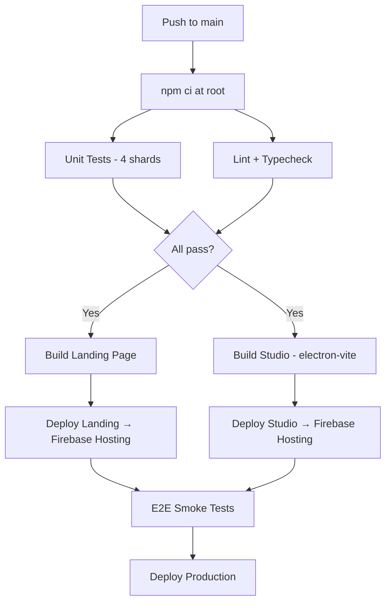

# indiiOS Monorepo Architecture

> **Migration completed:** April 6, 2026
> **From:** Flat single-package Electron + Firebase project
> **To:** npm workspace monorepo with five isolated packages

---

## Why We Did This

indiiOS started life as a single `package.json` project — one directory with the Electron main process, the React renderer, Firebase Cloud Functions, shared type contracts, and the landing page website all living together in the same dependency tree. This is normal for early-stage products. You move fast, everything imports everything, and the friction is low.

The problem is that this structure doesn't scale. Here's what was actually breaking:

### 1. Dependency Collisions

The Electron main process runs in **Node.js**. The renderer runs in a **Chromium browser**. Firebase Cloud Functions run on **Google's serverless infrastructure**. These are three fundamentally different runtime environments, but they were all sharing a single `node_modules` tree. A dependency that the renderer needed (say, a React UI library) would get installed alongside dependencies that only Cloud Functions needed (say, the Stripe SDK). This created:

- **Bloated bundles** — Vite had to tree-shake through thousands of packages that had nothing to do with the frontend.
- **Version conflicts** — The renderer needed one version of `zod`, Functions needed another. With one `package.json`, you get one version. Someone loses.
- **Phantom dependencies** — Code could accidentally import a package that happened to be installed for a *different* part of the system. It works locally. It crashes in production.

### 2. Build Entanglement

When everything lives in one directory, every build tool has to understand the entire project. The Vite config had to know about Electron main process files it would never bundle. The TypeScript config had to include Cloud Functions source alongside React components. A lint error in a Firebase trigger could block the renderer from building. The blast radius of any change was the entire codebase.

### 3. Deployment Coupling

Firebase Functions deploy independently from the Electron app, which deploys independently from the landing page. But with a flat structure, all three shared a single CI/CD pipeline configuration that had to carefully `cd` into subdirectories and hope the right dependencies were available. A change to the landing page's build script could break the studio deployment.

### 4. Team Scalability

As the codebase grew (40+ services, 20+ modules, an agent fleet, a Python sidecar), the single-package structure made it impossible to reason about boundaries. Where does the "main process" end and the "renderer" begin? What types are shared contracts vs. implementation details? Without physical package boundaries, these questions had no enforceable answers.

---

## What We Built

The migration restructured `indiiOS-Clean` into **five npm workspace packages**, each with its own `package.json`, `tsconfig.json`, and clear responsibility:

```
indiiOS-Clean/
├── package.json                  ← Root: workspace orchestrator
├── electron.vite.config.ts       ← Unified Electron build config
│
├── packages/
│   ├── main/                     ← Electron main process (Node.js)
│   │   ├── package.json
│   │   ├── tsconfig.json
│   │   └── src/
│   │       ├── index.ts          ← Main process entry
│   │       ├── preload.ts        ← Context bridge (IPC)
│   │       └── services/         ← OS-level services (keytar, SFTP, FFmpeg)
│   │
│   ├── renderer/                 ← React app (Chromium)
│   │   ├── package.json
│   │   ├── tsconfig.json
│   │   └── src/
│   │       ├── core/             ← App shell, store, routing
│   │       ├── modules/          ← 20+ lazy-loaded feature modules
│   │       ├── services/         ← 40+ business logic services
│   │       ├── components/       ← Shared UI components
│   │       └── hooks/            ← Custom React hooks
│   │
│   ├── firebase/                 ← Cloud Functions + Security Rules
│   │   ├── package.json
│   │   ├── tsconfig.json
│   │   ├── firestore.rules
│   │   ├── storage.rules
│   │   └── src/
│   │       ├── stripe/           ← Payment processing
│   │       ├── subscription/     ← Subscription management
│   │       └── shared/           ← Shared schemas/types
│   │
│   ├── shared/                   ← Cross-package type contracts
│   │   ├── package.json
│   │   ├── tsconfig.json
│   │   └── src/
│   │       ├── ipc/              ← ElectronAPI interface
│   │       ├── types/            ← Shared TypeScript types
│   │       └── schemas/          ← Shared Zod validation schemas
│   │
│   └── landing/                  ← Marketing website (Next.js/Vite)
│       ├── package.json
│       ├── tsconfig.json
│       └── src/
```

### The Root Package

The root `package.json` doesn't contain application code. It's a **workspace orchestrator** — it declares the five packages, holds shared dev dependencies (ESLint, Vitest, TypeScript), and provides top-level scripts (`npm run dev`, `npm test`, `npm run build`) that delegate to the appropriate workspace.

```json
{
  "workspaces": [
    "packages/main",
    "packages/renderer",
    "packages/firebase",
    "packages/shared",
    "packages/landing"
  ]
}
```

When you run `npm install` at the root, npm hoists shared dependencies to the top-level `node_modules/` and creates symlinks for each workspace package. This means `packages/renderer` can import from `@indiios/shared` as if it were a published npm package — but it resolves to the local source code.

### The Shared Package

`packages/shared` is the **contract layer**. It contains:

- **`ElectronAPI` interface** — The exact shape of the IPC bridge between main and renderer. Both sides import this type, so if the main process changes an IPC method signature, the renderer gets a compile error immediately.
- **Shared Zod schemas** — Validation schemas used by both the renderer and Cloud Functions (e.g., subscription plan schemas, user profile schemas).
- **Shared TypeScript types** — Domain types that cross package boundaries.

This package compiles to `.d.ts` declaration files. It has no runtime code — it's pure types.

### The Build System

We use **electron-vite** to build all three Electron targets (main, preload, renderer) from a single config file at the root. Each target points to its respective package:

| Target | Entry Point | Output | Runtime |
|--------|-------------|--------|---------|
| Main | `packages/main/src/index.ts` | `dist/main/` | Node.js |
| Preload | `packages/main/src/preload.ts` | `dist/preload/` | Isolated context |
| Renderer | `packages/renderer/src/` | `dist/renderer/` | Chromium |

Firebase builds independently with `tsc` inside its own package, outputting to `packages/firebase/lib/`.

---

## What This Gives Us

### Independent Versioning & Deployment

Each package can be built, tested, and deployed independently. A hotfix to Cloud Functions doesn't require rebuilding the Electron app. A landing page update doesn't touch the renderer.

### Enforced Boundaries

If `packages/renderer` tries to import a Node.js module (like `fs` or `keytar`), it fails at compile time. If `packages/firebase` tries to import a React component, it fails. The package boundaries are **physical** — not just conventions that someone might forget.

### Faster CI/CD

GitHub Actions can now run tests and builds in parallel across packages. The renderer tests don't wait for Firebase to compile. The landing page build doesn't block the studio deployment.

### Cleaner Dependencies

Each package declares exactly what it needs. The renderer has React, Framer Motion, and Zustand. The main process has keytar and SSH2. Firebase has the Admin SDK and Stripe. No cross-contamination.

### Scalability

Adding a new package (e.g., a CLI tool, a mobile companion app, a separate API server) is now a matter of creating a new directory in `packages/` and adding it to the workspace list. It immediately gets access to shared types and the existing build infrastructure.

---

## How the CI/CD Pipeline Works Now



A single `npm ci` at the root installs all workspace dependencies. Each build step targets its specific package output directory:

- **Landing** → `packages/landing/dist` → Firebase Hosting (`landing` target)
- **Studio** → `dist/renderer` → Firebase Hosting (`app` target)

---

## Key Design Decisions

| Decision | Rationale |
|----------|-----------|
| **npm workspaces** over pnpm/yarn | Already using npm; minimal migration friction. npm 10+ workspaces are stable and well-supported. |
| **Five packages** (not more) | Maps 1:1 to deployment targets + shared contracts. More granular splitting would add overhead without proportional benefit at current scale. |
| **Symlink backward compatibility** | `src/` → `packages/renderer/src/` symlink preserves existing path aliases (`@/`) during the transition. Zero changes needed in application code. |
| **Shared package is types-only** | No runtime code in the contract layer. Avoids circular dependency risks and keeps the shared package zero-cost at runtime. |
| **`electron-vite` as unified builder** | Single config handles all three Electron targets with proper externalization and environment isolation. |

---

## For Future Contributors

If you're new to this codebase, here's what you need to know:

1. **Run `npm install` at the root.** Never `cd` into a package and run `npm install` there — it will desynchronize the lockfile.
2. **Shared types go in `packages/shared`.** If both the renderer and Firebase need a type, it belongs there.
3. **Node.js APIs stay in `packages/main`.** The renderer cannot access the filesystem, spawn processes, or use native modules directly. Everything goes through IPC.
4. **Each package has its own `tsconfig.json`.** They extend a shared base but configure their own target, lib, and module resolution.
5. **Tests run from the root.** `npm test` executes Vitest across all workspaces. You can scope with `npm test -- --testPathPattern=packages/renderer`.

---

*This document reflects the architecture as of the migration completion on April 6, 2026. For the detailed migration checklist and verification results, see the session walkthrough in `.gemini/antigravity/brain/`.*
