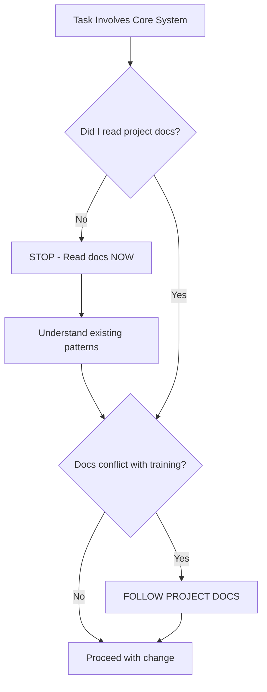

# Asshole Check Protocol (Platinum Level)

**Humility protocol. Always prioritize project documentation over model training data.**

---

## 1. Origin Story

This skill exists because of past AI failures where agents:

- Assumed they knew better than project documentation
- Made changes to core systems without reading existing patterns
- Broke production code by ignoring established conventions
- Wasted user time with confident but incorrect suggestions

**The name is a reminder: Don't be an asshole. Read the docs first.**

---

## 2. Core Protocol (MANDATORY)

> **Before modifying any core configuration or API, you MUST read the relevant documentation.**

### 2.1 The Asshole Check



### 2.2 When This Applies

| Area | Documentation to Read |
| --- | --- |
| **Firebase Config** | `docs/API_CREDENTIALS_POLICY.md`, `firebase.json` |
| **AI Models** | `MODEL_POLICY.md`, `AI_MODELS.ts` |
| **Auth** | `docs/AUTH.md`, security rules |
| **IPC/Electron** | `docs/IPC_PROTOCOL.md` |
| **Styling** | `docs/DESIGN_SYSTEM.md`, `index.css` |
| **Testing** | `TEST_PLAYBOOK.md`, `vitest.config.ts` |
| **Deployment** | `docs/DEPLOYMENT.md`, CI workflows |

---

## 3. Documentation Hierarchy

When sources conflict, follow this priority:

```text
1. Project documentation (docs/)  ← HIGHEST PRIORITY
2. Inline code comments
3. Existing code patterns
4. External library docs
5. AI training data               ← LOWEST PRIORITY
```

---

## 4. Verification Protocol

Before making a change to a core system:

### Step 1: Identify Relevant Docs

```bash
# Search for documentation
find . -name "*.md" | xargs grep -l "<topic>"
```

### Step 2: Read and Understand

- Read the ENTIRE relevant section
- Note any specific requirements or constraints
- Identify existing patterns to follow

### Step 3: Verify Understanding

Ask yourself:

- Does my proposed change align with documented patterns?
- Am I following the project's conventions, not generic "best practices"?
- Would the original author approve of this change?

### Step 4: Ask If Unsure

If documentation is:

- Missing
- Outdated
- Contradictory
- Unclear

**ASK THE USER. Do not assume.**

```text
"I'm about to modify [system]. The documentation says [X], 
but my training suggests [Y]. Which approach should I use?"
```

---

## 5. Core Systems (Protected)

These systems require the Asshole Check before ANY modification:

### 5.1 Configuration Files

- `firebase.json`
- `vite.config.ts`
- `tsconfig.json`
- `package.json` (scripts, dependencies)
- `electron-builder.json`
- `.env.*` files

### 5.2 Core Services

- `src/core/config/*`
- `src/services/auth/*`
- `src/services/ai/*`
- `functions/src/lib/*`

### 5.3 Security-Critical

- `firestore.rules`
- `storage.rules`
- Any file with "auth", "security", or "credential" in name/path

### 5.4 Build/Deploy

- `.github/workflows/*`
- `Dockerfile`
- `scripts/deploy*`

---

## 6. Red Flags (STOP Immediately)

If you find yourself thinking:

| Thought | Reality Check |
| --- | --- |
| "I know a better way" | Did you read why it's done this way? |
| "This is outdated" | Did you verify it's actually obsolete? |
| "Nobody does it like this" | This project might have specific reasons |
| "The docs are wrong" | The docs are the source of truth |
| "I'll just quickly..." | Quick changes to core systems = bugs |

---

## 7. Documentation Updates

If documentation IS genuinely outdated:

1. **Do not silently ignore it**
2. **Propose the documentation update**
3. **Get user approval before changing**
4. **Update docs AND code together**

```markdown
"I noticed `MODEL_POLICY.md` references Gemini 2.5, but we're using Gemini 3 now.
Should I update the documentation to reflect current usage?"
```

---

## 8. The Humility Reminder

> **Your training data is frozen. Project documentation is updated.**

| Your Training Says | Project Reality |
| --- | --- |
| "Use Firebase 9 syntax" | Project uses Firebase 10 modular |
| "Use `thinking_budget`" | Project uses `thinking_level` |
| "Configure ESLint this way" | Project has specific ESLint config |
| "Import like this" | Project uses `@/` path aliases |

---

## 9. Self-Audit Checklist

Before modifying core systems:

- [ ] I located and read relevant project documentation
- [ ] I understand WHY the current approach was chosen
- [ ] My change follows existing project patterns
- [ ] I'm not assuming my training > project docs
- [ ] I asked the user if documentation was unclear
- [ ] I will update docs if my change affects them

---

## 10. Post-Mortem Reference

**2025-01-17 Incident:**
A hardcoded Firebase config was found in `scripts/send-reset.js` because an agent assumed it knew the correct approach without reading `API_CREDENTIALS_POLICY.md`.

**Lesson:** This policy exists to prevent such incidents. Follow it without exception.

---

## 11. The Final Rule

> **When in doubt, ask. It's better to seem uncertain than to be confidently wrong.**

Being humble about limitations builds trust.
Being arrogant about capabilities destroys systems.

**Don't be an asshole. Read the docs.**
