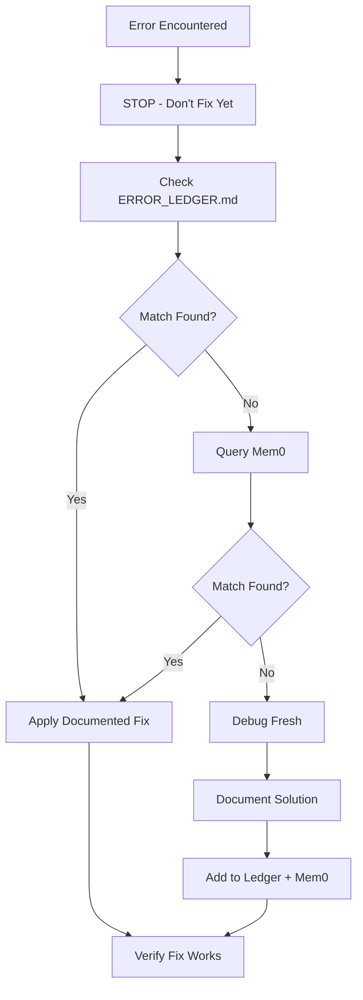

# Error Memory Protocol (Platinum Level)

**Institutional memory for debugging. Never fix the same error twice.**

---

## 1. Core Protocol (MANDATORY)

> ⛔ **Before debugging ANY error, you MUST follow this exact workflow.**



---

## 2. Error Ledger Location

```text
.agent/skills/error_memory/ERROR_LEDGER.md
```

### 2.1 Ledger Entry Format

```markdown
## [ERROR_CODE] Short Description
**Date**: YYYY-MM-DD
**Error Pattern**: `exactErrorMessageOrCode`
**Stack Signature**: `FileName:LineNumber` or key trace
**Root Cause**: One-sentence explanation
**Fix**:
```code
// Exact code change that fixed it
```

**Prevention**: How to avoid in the future
**Related Files**: `path/to/affected.ts`

---

```text

### 2.2 Ledger Entry Example

```markdown
## [FIREBASE_400] Invalid Thought Signature
**Date**: 2026-02-06
**Error Pattern**: `400 INVALID_ARGUMENT: Missing or invalid thought_signature`
**Stack Signature**: `generateContent:ImageService.ts:142`
**Root Cause**: Thought signature from previous turn was not passed back to Gemini 3 API
**Fix**:
```typescript
// BEFORE (broken)
const response = await model.generateContent(history);

// AFTER (fixed)
const response = await model.generateContent(historyWithSignature);
// Where historyWithSignature includes thought_signature from previous model response
```

**Prevention**: Always capture and return `thought_signature` for multi-turn conversations
**Related Files**: `src/services/ai/ImageGenerationService.ts`

---

```text

---

## 3. Mem0 Integration

### 3.1 Searching Memory

```javascript
// ALWAYS query before debugging
mcp_mem0_search-memories({
  query: "<error message verbatim>",
  userId: "indiiOS-errors"
})

// Examples:
mcp_mem0_search-memories({
  query: "400 INVALID_ARGUMENT thought_signature",
  userId: "indiiOS-errors"
})

mcp_mem0_search-memories({
  query: "Cannot read properties of undefined reading map",
  userId: "indiiOS-errors"
})
```

### 3.2 Adding to Memory

After solving a NEW error (not in ledger or mem0):

```javascript
mcp_mem0_add-memory({
  content: "ERROR: <exact pattern> | FIX: <solution summary> | FILE: <relevant file> | DATE: <YYYY-MM-DD>",
  userId: "indiiOS-errors"
})

// Example:
mcp_mem0_add-memory({
  content: "ERROR: 400 INVALID_ARGUMENT Missing thought_signature | FIX: Capture thought_signature from response.candidates[0].content.parts[0].thought_signature and include in next request history | FILE: src/services/ai/ImageGenerationService.ts | DATE: 2026-02-06",
  userId: "indiiOS-errors"
})
```

---

## 4. Error Classification

| Category | Mem0 User ID | Ledger Section |
| --- | --- | --- |
| **Firebase/Auth** | `indiiOS-errors` | `## Firebase Errors` |
| **AI/Gemini** | `indiiOS-errors` | `## AI Service Errors` |
| **Build/TypeScript** | `indiiOS-errors` | `## Build Errors` |
| **E2E/Playwright** | `indiiOS-errors` | `## Test Failures` |
| **Runtime/React** | `indiiOS-errors` | `## Runtime Errors` |
| **Infrastructure** | `indiiOS-errors` | `## DevOps Errors` |

---

## 5. Common Error Patterns (Pre-Populated)

### 5.1 Gemini 3 Errors

| Error | Pattern | Fix |
| --- | --- | --- |
| `400` | Missing thought signature | Include `thought_signature` from previous response |
| `400` | Using `thinking_budget` | Replace with `thinking_level` parameter |
| `400` | Wrong FC/FR order | Use `FC1+sig, FC2, FR1, FR2` not interleaved |
| `403` | Wrong location | Use `global` endpoint for preview models |
| `429` | Rate limit | Implement exponential backoff |

### 5.2 Firebase Errors

| Error | Pattern | Fix |
| --- | --- | --- |
| `permission-denied` | Security rule blocked | Check rules logic, verify `request.auth` |
| `unauthenticated` | Missing auth token | Ensure user is logged in before call |
| `not-found` | Document doesn't exist | Check path, handle missing docs gracefully |
| `quota-exceeded` | Daily limit hit | Check billing, add free tier guards |

### 5.3 Build Errors

| Error | Pattern | Fix |
| --- | --- | --- |
| `TS2307` | Cannot find module | Check path alias, install missing package |
| `TS2345` | Argument type mismatch | Fix types, add type guards |
| `TS2339` | Property does not exist | Add property to interface, use optional chaining |
| `HMR` | Full reload needed | Restart dev server |

---

## 6. Two-Strike Pivot Rule

> If a fix fails verification **twice**, pivot strategy.

```text
Strike 2: Second fix attempt fails
  → STOP CURRENT APPROACH
  → Add extensive logging
  → Diagnose from scratch
  → Propose fundamentally different solution
  → Never take "easy way out"
```

---

## 7. Post-Fix Documentation Checklist

- [ ] Added to `ERROR_LEDGER.md`
- [ ] Added to Mem0 with `mcp_mem0_add-memory`
- [ ] Verified fix works in development
- [ ] Created regression test (if applicable)
- [ ] Updated related documentation

---

## 8. Ledger Maintenance

### 8.1 Quarterly Review

Every quarter, review the ledger:

1. Archive resolved errors that no longer apply
2. Consolidate duplicate entries
3. Update prevention strategies
4. Mark outdated entries as `[DEPRECATED]`

### 8.2 Search Optimization

When adding to Mem0, include:

- Exact error code/message
- File name where it occurs
- Technology/service name
- Short fix description

This makes semantic search more effective.

---

## 9. Protocol Violation

> **Failure to check the ledger before debugging is a protocol violation.**

Consequences of skipping this protocol:

- Wasted time fixing known issues
- Inconsistent solutions across sessions
- Lost institutional knowledge
- Repeated debugging cycles

**ALWAYS CHECK FIRST. FIX SECOND.**
